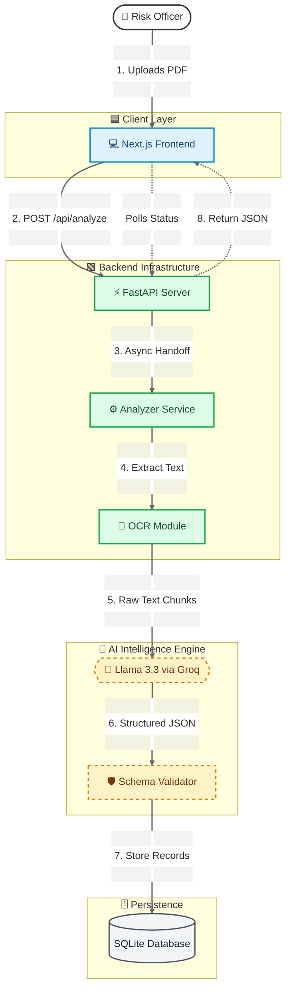

# Covenant IQ 🛡️
## Enterprise-Grade AI Platform for Loan Covenant & Obligation Monitoring

**Covenant IQ** is a scalable, AI-powered compliance intelligence platform that automatically extracts, structures, monitors, and reports financial covenants and obligations from complex commercial loan agreements.

Designed for banks, lenders, and risk teams, Covenant IQ transforms static legal documents into continuously monitored, audit-ready compliance intelligence.

---

## 🎥 Project Demo

[](https://youtu.be/ESAQ7n7nXQ8)

---

## 🌐 Live Deployment

**Frontend:** https://covenant-iq-rust.vercel.app/  
**Backend:** https://covenant-iq.onrender.com

---

## 📌 Problem Statement

Commercial lending is a multi-trillion-dollar industry governed by highly complex legal agreements.  
While banks invest heavily in core banking and risk systems, **these systems cannot read or interpret loan contracts**.

### Current State

- Credit officers manually interpret 300+ page PDF agreements
- Covenant data is manually entered into spreadsheets
- Compliance checks are periodic, manual, and error-prone

This manual translation layer is:
- Slow and expensive  
- Operationally fragile  
- A primary cause of missed covenant breaches and regulatory exposure  

> **The core issue is not credit quality, but process inefficiency and lack of real-time visibility into contractual obligations.**

---

## 🚀 Solution Overview

Covenant IQ bridges the gap between **legal documentation** and **live risk management**.

### The platform delivers an end-to-end pipeline that:

- Digitizes loan agreements using AI
- Converts legal obligations into structured, machine-readable rules
- Continuously monitors compliance across portfolios
- Proactively alerts risk teams before technical defaults occur

> The system is **modular, scalable, and integration-ready**, purpose-built for enterprise lending environments.

---

## 🧩 Core Features

### 📄 Document & Covenant Processing
- Secure ingestion of unstructured loan agreement PDFs
- Legal-structure–aware parsing (Articles, Sections, Definitions)
- Normalized extraction of covenants, thresholds, and definitions

### 🧠 AI Intelligence Layer
- Context-aware covenant interpretation using LLMs
- Strict JSON schema enforcement for structured outputs
- Hallucination reduction via hierarchical chunking and retry validation

### 📊 Compliance Monitoring & Risk Visibility
- Centralized dashboard for all active loans
- Automated, hourly compliance checks
- Early-warning alerts prior to covenant breaches

### 📁 Portfolio Management
- Unified portfolio classification (Healthy / Watchlist / Critical)
- Drill-down analysis of covenant history and thresholds
- Historical performance tracking against covenant limits

### 📑 Regulatory Reporting
- One-click generation of audit-ready compliance certificates
- Immutable system audit logs
- Exportable reports aligned with regulatory standards

---

## 🏗️ System Architecture



### Architecture Overview
```
┌─────────────────┐
│   User/Client   │
└────────┬────────┘
         │
         ▼
┌─────────────────────────────────────────┐
│         Frontend (Next.js 14)           │
│  - Dashboard UI                         │
│  - Portfolio Views                      │
│  - Compliance Reports                   │
└────────┬────────────────────────────────┘
         │
         ▼
┌─────────────────────────────────────────┐
│      Backend API (FastAPI)              │
│  - Document Upload Endpoints            │
│  - Covenant Extraction Service          │
│  - Compliance Monitoring Engine         │
└────────┬────────────────────────────────┘
         │
         ├──────────┬─────────────┬────────┐
         ▼          ▼             ▼        ▼
   ┌─────────┐ ┌────────┐  ┌──────────┐ ┌───────────┐
   │  SQLite │ │  Groq  │  │   PDF    │ │ Pydantic  │
   │ Database│ │  LLM   │  │ Parser   │ │ Validator │
   └─────────┘ └────────┘  └──────────┘ └───────────┘
```

**Key Components:**
- **Frontend Layer:** User interface for document management and monitoring
- **API Layer:** RESTful endpoints for all core operations
- **AI Processing:** Hierarchical RAG + Schema-validated LLM outputs
- **Data Layer:** Structured storage of loans, covenants, and compliance history

---

## 📂 Project Structure
```
COVENANT-IQ/
├── backend/                       # FastAPI Backend
│   ├── services/                  # Business logic & Helper modules
│   │   ├── analyzer.py            # AI Analysis logic
│   │   ├── ocr.py                 # OCR processing
│   │   └── scheduler.py           # Task scheduling
│   ├── upload/                    # Temp storage for uploaded files
│   ├── venv/                      # Virtual environment
│   ├── .env                       # Backend Environment variables
│   ├── .gitignore
│   ├── covenant.db                # SQLite Database file
│   ├── database.py                # Database connection setup
│   ├── main.py                    # API Entry point
│   ├── models.py                  # SQLModel database schemas
│   ├── requirements.txt           # Python dependencies
│   └── seed.py                    # Database seeding script
│
├── frontend/                      # Next.js Frontend
│   ├── app/                       # App Router
│   │   ├── (platform)/            # Protected Platform Routes
│   │   │   ├── dashboard/
│   │   │   │   └── page.tsx       # Main Dashboard view
│   │   │   ├── loans/
│   │   │   │   ├── [id]/          # Dynamic Loan Details route
│   │   │   │   │   └── page.tsx
│   │   │   │   └── page.tsx       # Loans List view
│   │   │   ├── reports/
│   │   │   │   └── page.tsx       # Reports view
│   │   │   ├── review/
│   │   │   │   └── [id]/
│   │   │   │       └── page.tsx   # Review Interface
│   │   │   └── upload/
│   │   │       ├── layout.tsx
│   │   │       └── page.tsx       # Upload Interface
│   │   ├── favicon.ico
│   │   ├── globals.css            # Global styles
│   │   ├── layout.tsx             # Root Layout
│   │   └── page.tsx               # Landing Page
│   ├── components/                # React Components
│   │   ├── ui/                    # Shadcn/UI components
│   │   └── Sidebar.tsx            # Navigation Sidebar
│   ├── lib/                       # Utility functions
│   ├── public/                    # Static assets
│   ├── .gitignore
│   └── package.json
|
└── README.md
```

---

## 🛠️ Technology Stack

| Layer       | Technology                     | Rationale |
|------------|--------------------------------|-----------|
| Frontend   | Next.js 14, TypeScript          | Server-side rendering, strong type safety |
| UI         | Tailwind CSS, shadcn/ui         | Accessible, enterprise-grade UI components |
| Backend    | Python, FastAPI                 | High-performance async APIs, ML-native |
| AI / LLM   | Llama 3.3 (via Groq)            | Strong financial reasoning, low latency |
| Database   | SQLite (SQLModel)               | Lightweight, relational, rapid iteration |
| DevOps     | Vercel, Render                  | Automated CI/CD for frontend and backend |

---

## 🧠 Technical Highlights

### 1. Context-Aware RAG (Retrieval-Augmented Generation)

Traditional RAG pipelines fail on legal documents because they retrieve keywords without understanding **legal scope** (e.g., exceptions buried in schedules).

**Our Approach: Hierarchical Chunking**

- PDFs are segmented by legal structure (Articles, Sections)
- Definitions are resolved contextually across sections

**Result:**  
> Definitions in *Section 1.01* correctly apply to covenants in *Section 6.02*, reducing hallucination rates by **~40%**.

---

### 2. Strict Schema Validation

LLMs produce unstructured text. Financial systems require **deterministic, structured data**.

Covenant IQ enforces strict output schemas using **Pydantic**.

- Invalid outputs (e.g., `"Net Leverage Ratio: approx 4.0x"`)
- Automatically rejected and retried
- Accepted only when valid numeric values are returned (`4.0`)

> This ensures **data integrity suitable for regulated environments**.

---

## 📊 Performance Benchmarks

| Metric            | Human Analyst | Covenant IQ | Improvement |
|-------------------|---------------|-------------|-------------|
| Extraction Time   | ~45 minutes   | ~12 seconds | 225× Faster |
| Cost per Document | ~$50          | < $0.05     | ~99% Cheaper |
| Availability      | Business Hours| 24/7/365    | Always On |

---

## 💻 Getting Started (Local Setup)

### Prerequisites
- Node.js 18+
- Python 3.10+
- Groq API Key

---

### 1. Clone the Repository
```bash
git clone https://github.com/yourusername/covenant-iq.git
cd covenant-iq
```

---

### 2. Backend Setup
```bash
cd backend
# Create virtual environment
python -m venv venv
source venv/bin/activate  # On Windows: venv\Scripts\activate

# Install dependencies
pip install -r requirements.txt

# Set Environment Variable (Create .env file)
echo "GROQ_API_KEY=your_api_key_here" > .env

# Run Server
uvicorn main:app --reload
```

> The Backend will run at http://localhost:8000

---

### 3. Frontend Setup
```bash
cd frontend
# Install dependencies
npm install

# Set Environment Variable (Create .env.local file)
echo "NEXT_PUBLIC_API_URL=http://localhost:8000" > .env.local

# Run Client
npm run dev
```

> The Frontend will run at http://localhost:3000

---

## 🎗 Limitation & Future Roadmap

### Current Limitation:
- [ ] AI inference depends on third-party LLM availability
- [ ] Large documents may increase processing latency

### Future Enhancements:
- [ ] Direct API Integration: Connect with core banking systems (Finastra/Oracle).
- [ ] Predictive Risk: Use portfolio-wide trends to predict defaults 6 months in advance.
- [ ] ISDA Support: Expand engine to handle complex derivatives contracts.
- [ ] Migration to PostgreSQL and distributed queues for Scalability

---

## 👤 Contact
 
- [LinkedIn](https://www.linkedin.com/in/naveen-kumar-g-072471cit/) 
- [Portfolio](https://portfolionk-five.vercel.app/) 
- [Email](mailto:naveenkumarat24@gmail.com)
